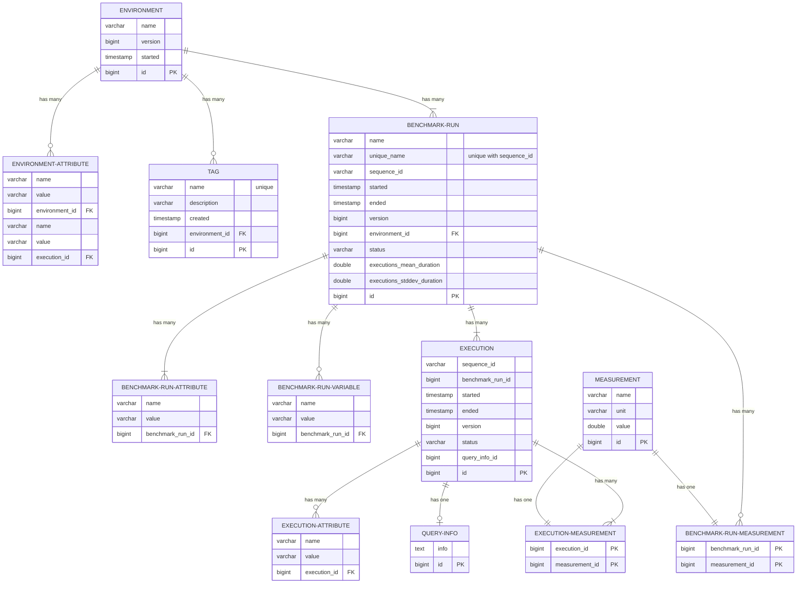

Benchto Data Model
==================

This document describes the data model for the Benchto Service to store performance test (benchmark) results.
For the benchmark definitions (descriptor), see [the Benchto Driver README](/benchto-driver/README.md#benchmark-descriptor).

## Environment

An environment represents both the System Under Test (SUT) and the performance tests (benchmarks) that are executed on it.

When testing different versions of a SUT, create a separate environment for every version
and store the version number as an environment attribute.

Any configuration of the SUT that can affect results of performance tests should also be recorded as environment attributes.

If the benchmark definition change, a new environment should be created.
If benchmark definitions are stored in a Git repository, the SHA of the commit containing
the currently used benchmarks can be stored as an environment attribute or in its name.

Attributes that don't have values can be saved as environment tags.

## Benchmark run

A benchmark run represents a single performance test executed one or more times in an environment.
The definition of a benchmark, that describes the task (query) being executed, should be stored as a benchmark run attribute.
This can include:
* an SQL query text
* server properties
* number of times to execute the query

The same benchmark can be executed multiple times in different combinations,
so the parameters used in query or macro templates should be stored as benchmark variables.

Every benchmark run needs to have a unique name. It can be a string representation of all its attributes and variables, or a hash of it.

A benchmark can be executed in the same environment multiple times, so every benchmark run needs to have a unique sequence ID.
It can be a timestamp or a monotonic counter.

A benchmark run is created with the status `STARTED` and should be finally updated to `ENDED` or `FAILED`.

## Execution

Benchmark runs can be executed more than once to help detect anomalies, so every benchmark run execution is recorded separately.

Execution details, like query ID, can be recorded as an execution attribute.

## Measurement

A measurement represents the value for a specific metric. Measurements recorded for every benchmark run execution
can include the query duration or other statistics related to this execution.
Measurements recorded for the whole benchmark run can include the SUT statistics or the host resource usage (CPU, memory, network, etc.).

