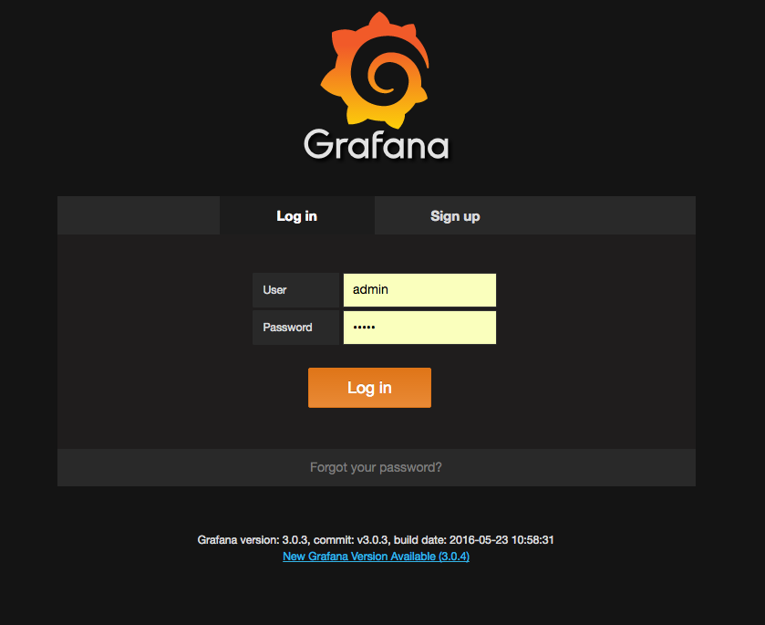
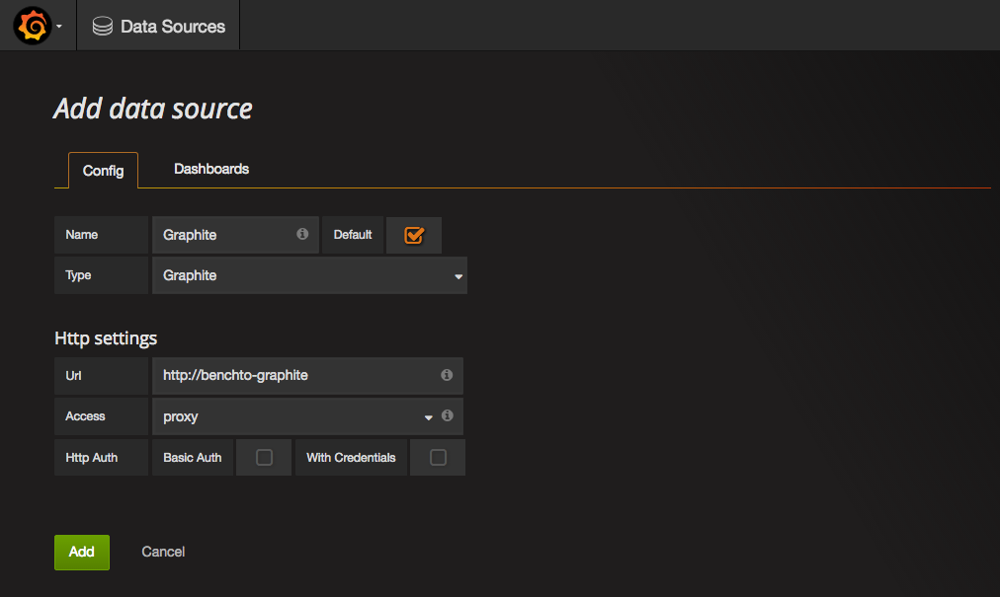
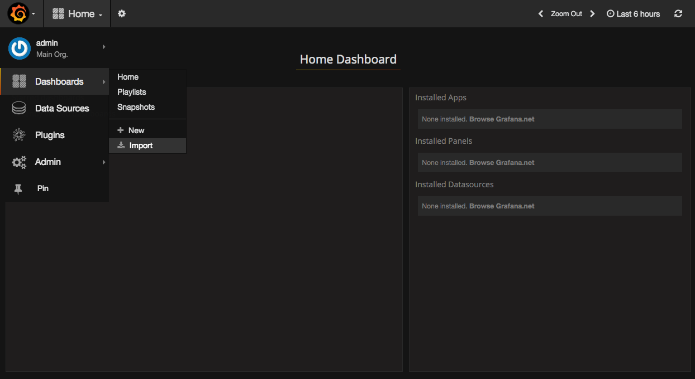
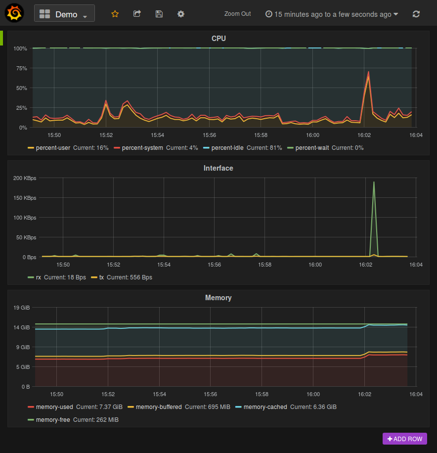
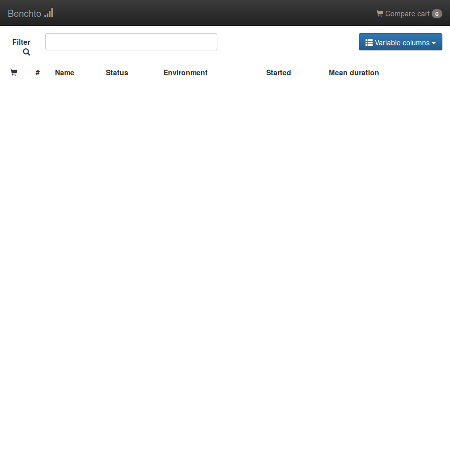

# Getting Started

This document describes how to setup and start Benchto on local machine.

## Prerequisites

* Docker >= 1.8
* Maven 3
* JDK 8

## Note on docker-machine

The urls in this tutorial, for services exposed from docker containers, use `dockerhost` as hostname.

If you use [docker-machine](https://docs.docker.com/machine/overview/), use IP of docker machine as `dockerhost`. Docker machine IP can be obtained using:
```
$ docker-machine ip
```
or
```
$ docker-machine ip name_of_your_docker_machine
```

If you are running docker container on the same machine, on which docker client is used, use `127.0.0.1` as `dockerhost`.

The easiest way is to setup correct mapping in `/etc/hosts`.

## Build project

```
mvn clean install package -P docker-images
```

## Starting up local Hadoop in docker environment.

We will be using Hadoop CDH5 docker image which is available [here](https://hub.docker.com/r/teradatalabs/cdh5-hive/).
In order to start the Hadoop on your local machine run the following command:

```
docker run -d --name hadoop-master -h hadoop-master \
       -p 50070:50070 -p 10000:10000 -p 19888:19888 -p 8088:8088\
       -l collectd_docker_app=hadoop \
       -l collectd_docker_task=hadoop \
       teradatalabs/cdh5-hive
```

This will start a docker container with HDFS, Yarn and Hive running.
You can check if the services are up by visiting following pages:
* HDFS: [http://dockerhost:50070/dfshealth.html#tab-overview](http://dockerhost:50070/dfshealth.html#tab-overview)
* Yarn resource manager: [http://dockerhost:8088](http://dockerhost:8088)
* Yarn history server: [http://dockerhost:19888/jobhistory](http://dockerhost:19888/jobhistory)

## Generate data

In order to run benchmarks of hadoop based databse you need some data stored in HDFS. 

For purpose of this setup guide we have created a simple generator that easies process 
of generating test data of various types and formats. You can learn more about generator
by reading README file at `benchto-generator/README.md`. 

We will create 4 ORC files with 1 million of random bigint rows in total. To do so build and install the project:

Copy the generator jar to hadoop container:

```
docker cp benchto-generator/target/benchto-generator-1.0.0-SNAPSHOT.jar \
     hadoop-master:/tmp
```

Run the generator:

```
docker exec -it hadoop-master su hdfs -c "hadoop jar /tmp/benchto-generator-1.0.0-SNAPSHOT.jar \
                     -format orc -type bigint -rows 1000000 -mappers 4"
```

Expect output simillar to one below:

```
15/09/22 14:30:16 INFO generator.HiveTypesGenerator: Generating 1000000 bigints, directory: /benchmarks/benchto/types/orc-bigint/1000000, number of files: 4
15/09/22 14:30:17 INFO client.RMProxy: Connecting to ResourceManager at /0.0.0.0:8032
15/09/22 14:30:17 WARN mapreduce.JobSubmitter: Hadoop command-line option parsing not performed. Implement the Tool interface and execute your application with ToolRunner to remedy this.
15/09/22 14:30:18 INFO mapreduce.JobSubmitter: number of splits:4
15/09/22 14:30:18 INFO mapreduce.JobSubmitter: Submitting tokens for job: job_1442915754438_0003
15/09/22 14:30:18 INFO impl.YarnClientImpl: Submitted application application_1442915754438_0003
15/09/22 14:30:18 INFO mapreduce.Job: The url to track the job: http://hadoop-master:8088/proxy/application_1442915754438_0003/
15/09/22 14:30:18 INFO mapreduce.Job: Running job: job_1442915754438_0003
15/09/22 14:30:25 INFO mapreduce.Job: Job job_1442915754438_0003 running in uber mode : false
15/09/22 14:30:25 INFO mapreduce.Job:  map 0% reduce 0%
...
```

You also have to create Hive tables for the generated data:
```
docker exec -it hadoop-master su hdfs -c hive
```
And then in hive shell:
```
hive> CREATE DATABASE types_1m_orc;

hive> CREATE EXTERNAL TABLE types_1m_orc.bigint (value BIGINT)
      STORED AS ORC LOCATION '/benchmarks/benchto/types/orc-bigint/1000000';
```

To check if table was created correctly run:
```
hive> SELECT * FROM types_1m_orc.bigint LIMIT 5;
```
And expect 5 output rows.

## Starting up auxiliary services

Postgres, Graphite and Grafana (all available as docker images) are required by Benchto service.
Those services are used to store benchmark results and store and visualize cluster performance.

To run those as docker container execute following statements:

```
docker run --name benchto-postgres \
       -e POSTGRES_PASSWORD=postgres \
       -p 5432:5432 -d postgres
       
docker run --name benchto-graphite \
       -p 2003:2003 -p 18088:80 \
       -d hopsoft/graphite-statsd
       
docker run --name benchto-grafana \
       --link benchto-graphite:benchto-graphite \
       -p 3000:3000 -d grafana/grafana
```

Grafana web interface is available at: [http://dockerhost:3000/](http://dockerhost:3000/).

## Setup collectd monitoring agent on localhost

Collectd is used to measure performance of cluster nodes and push results to Graphite.
For testing purposes callectd will be setup on as docker container exposing stats of `hadoop-master`. 
In real world setups collectd would be installed on each node of the cluster. 

```
docker run --name benchto-collectd-docker --link benchto-graphite:benchto-graphite \
              -d -v /var/run/docker.sock:/var/run/docker.sock \
              -e GRAPHITE_HOST=benchto-graphite -e COLLECTD_HOST=benchto \
              bobrik/collectd-docker
```

## Configure Grafana dashboard

In order to view performance metrics in Grafana you have to setup
data source (Graphite) and dashboard. We have created an example
dashboard that will show CPU, network and memory performance from localhost.

Log into [Grafana](http://dockerhost:3000/) (user: ``admin``, password: ``admin``)



Navigate to ``Data Sources->Add data source`` and add Graphite data source as follows:



Navigate to ``Dashboard->Home`` and import dashboard from ``docs/getting-started/dashboard-grafana.json``



You should now see the Dashboard.

Click ``Save dashboard`` icon.



## Start benchto

Now, let's start the benchmark service itself. The Benchmark service is responsible
for storing and displaying benchmark results.

```
docker run --name benchto-service --link benchto-postgres:benchto-postgres \
        -e "SPRING_DATASOURCE_URL=jdbc:postgresql://benchto-postgres:5432/postgres" \
        -p 8080:8080 -d prestodev/benchto-service
```

Verify that the benchmark service works: [http://dockerhost:8080/#/](http://dockerhost:8080/#/)
You should see page similar to this:



## Creating environment

We also need to register a Benchto environment. Environments are
used in a multi-cluster setup, where each cluster has a separate
environment assigned.

```
curl -X POST -H 'Content-Type: application/json' -d '{
    "dashboardType": "grafana",
    "dashboardURL": "http://dockerhost:3000/dashboard/db/demo"
}' http://dockerhost:8080/v1/environment/DEMO
```

No you can visit environment page: [http://dockerhost:8080/#/DEMO](http://dockerhost:8080/#/DEMO)

## Running benchmark

In order to run benchmarks you have to start Benchto agent with appropriate parameters.
The preferred way to do this (especially when you have classpath dependencies like JDBC jars)
is by creating a maven project that launches the agent. An example of such project is
in `benchto-getting-started` directory. Benchmarks and SQL queries are located in
`src/main/resource/benchmarks` and `src/main/resource/sql` directories. The POM defines
`exec:java` task that launches the Benchto agent which runs benchmarks. You can used
this file as a template for your benchmarking projects. For more information about
benchmark agent look at `benchto-driver/README.md`.

Launch an example benchmark by running following commands:

```
cd docs/getting-started/tests
mvn package exec:java
```
Or if you do not setup mapping for `dockerhost` in `/etc/hosts` pass ip address as environemnt variable
```
cd docs/test/tests/benchto-getting-started
dockerhost=IP_OF_DOCKER_HOST mvn package exec:java

```

The progress and results are visible on benchto page: [http://dockerhost:8080/#/](http://dockerhost:8080/#/DEMO)

